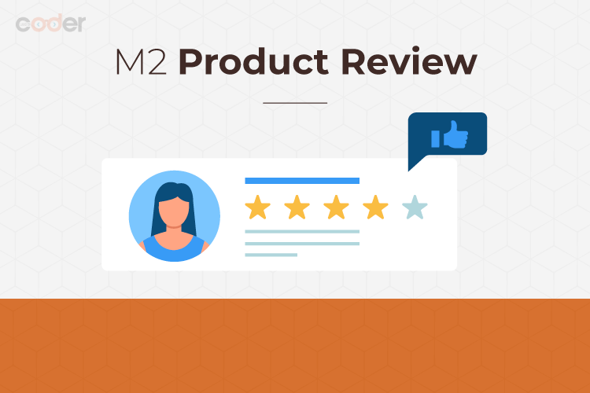
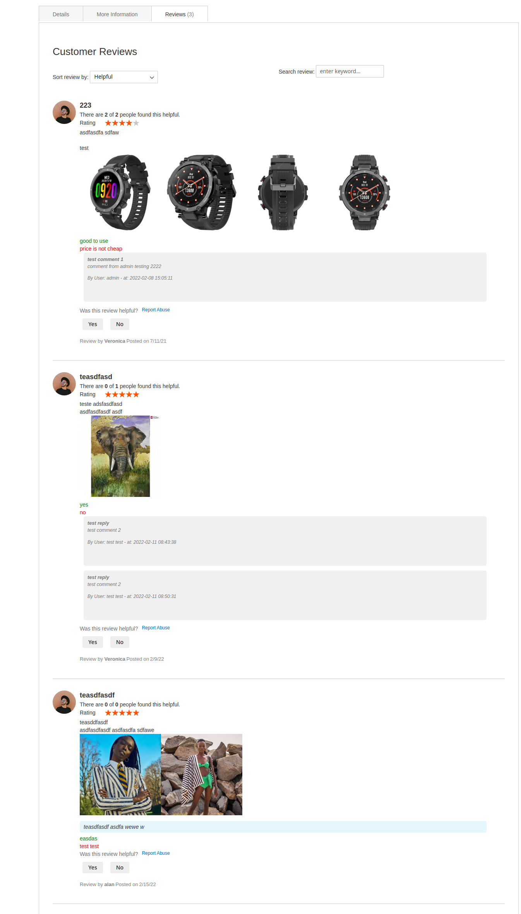

# magento-2-product-reviews
## [ADVANCED MAGENTO 2 PRODUCT REVIEWS EXTENSION](https://landofcoder.com/advanced-magento-2-product-reviews.html/)

OVERVIEW

Creating customers an excellent product experience will lead to compliments, where powerful mouth-of-word was born to improve your sales performance. Reviews are also the type of “mouth-of-word” in the Net in order to test product’s quality.

Knowing the importance of boosting the customer’s trust to stores via reviews, we developed Magento 2 Product Reviews Extension to boost your business to the new level. The extension gives customers an allowance to post images, rate the review helpful or not, and filter needed reviews to meet their demands.

- Review using images
- Allowed to upload multiple review images
- Add pros and cons about product
- Rate the review helpful or not
- Report Abuse displayed
- Smartly filtered reviews by star ratings, helpfulness, keywords
- Configure the review settings in one place
- Add, edit & delete images gallery
- Enable And Disable Gallery
- Friendly Reply from admin
- Send reminder emails with ease
- Review Summary included for Admin
- Multiple languages - RTL supports
- Fast Speed with Magento Block Caching
- Attractive Custom Work service
- Support REST APIs

1. **Enjoy Amazing Customer Experience With Us**



What customer experiences you really want to get? happiness, sadness, joy, fear, interest, anger, or trust? Coming with us, you will get the most enjoyable customer experiences. Our dedicated support team always here to help if you have any issue.

###### Install Extension
```
composer require landofcoder/module-product-reviews
php bin/magento module:enable Lof_ProductReviews
php bin/magento setup:upgrade
php bin/magento setup:static-content:deploy -f

```

###### manage product reviews extension
manage product reviews by navigation to ```Marketing > All Reviews ``` or ```Lof Product Reviews > All Reviews ```


## Features
- Review using Image with ease
- Images shown in fancybox slider
- Add likes and dislikes about product
- Rate the review helpful or not
- Reviews filtered by star ratings
- Configure the review settings in the blink of an eye
- Full control of managing the images & reviews
- Reply from admin
- Send email reminder
- Improve your rankings
- Multiple languages - RTL supports
- Fast speed with Magento Block Caching
- Attractive Custom Work service
- 100% open source
- Lifetime free Update
- Perfectly compatible with the latest magento 2.3 version
- Easy to manage with backend management\
- New option required/non required verify purchase code when review
- Support Backend REST API
- Support Frontend REST API get product reviews
- Support Frontend REST API submit reviews
- Support REST API for reply


## Todo
- View Replies list on frontend
- Allow User Submit Reply a comment on frontend
- GraphQl module

## Demo



## Donation

If this project help you reduce time to develop, you can give me a cup of coffee :) 

[](https://www.paypal.com/paypalme/allorderdesk)


**Our Magento 2 Extensions List**

* [Megamenu for Magento 2](https://landofcoder.com/magento-2-mega-menu-pro.html/)

* [Page Builder for Magento 2](https://landofcoder.com/magento-2-page-builder.html/)

* [Magento 2 Marketplace - Multi Vendor Extension](https://landofcoder.com/magento-2-marketplace-extension.html/)

* [Magento 2 Multi Vendor Mobile App Builder](https://landofcoder.com/magento-2-multi-vendor-mobile-app.html/)

* [Magento 2 Form Builder](https://landofcoder.com/magento-2-form-builder.html/)

* [Magento 2 Reward Points](https://landofcoder.com/magento-2-reward-points.html/)

* [Magento 2 Flash Sales - Private Sales](https://landofcoder.com/magento-2-flash-sale.html)

* [Magento 2 B2B Packages](https://landofcoder.com/magento-2-b2b-extension-package.html)


**Featured Magento Services**

* [Hire Magento 2 Development Team](https://landofcoder.com/magento-2-create-online-store/)

* [Dedicated Magento 2 Developer](https://landofcoder.com/magento-support-ticket.html/)

* [Magento 2 Multi Vendor Development](https://landofcoder.com/magento-2-create-marketplace/)

* [Magento Website Maintenance Service](https://landofcoder.com/magento-2-customization-service/)

* [Magento Professional Installation Service](https://landofcoder.com/magento-2-installation-service.html)

* [Customization Service](https://landofcoder.com/magento-customization-service.html)
